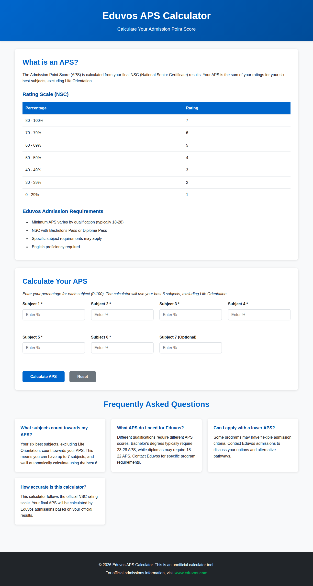
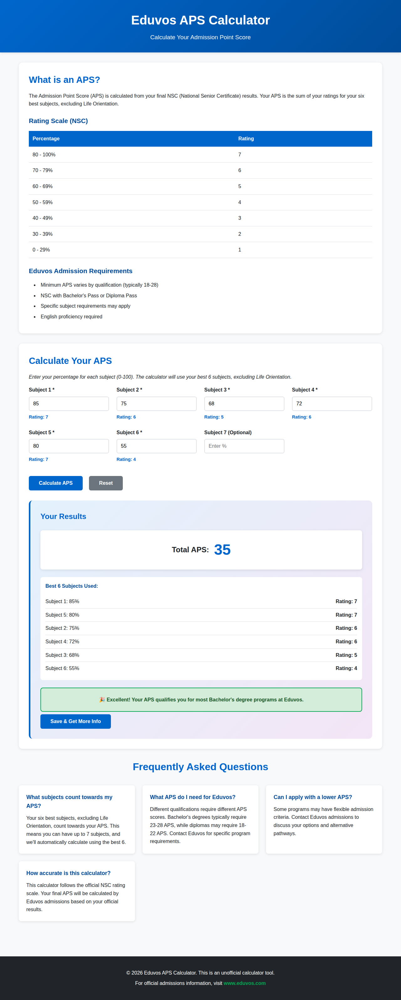
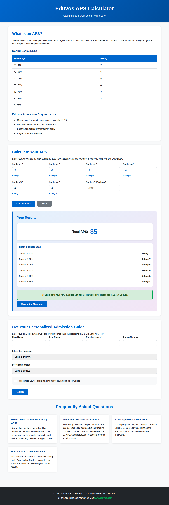
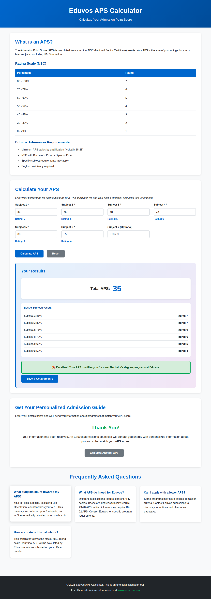
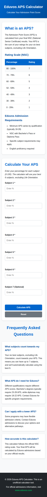

# Eduvos APS Calculator - Screenshots

This document showcases the user interface of the Eduvos APS Calculator.

## Desktop View

### Home Page

*The main landing page with information about APS calculation, rating scale, and admission requirements.*

### Calculator with Results

*The calculator showing a completed APS calculation with a score of 35 and breakdown of subjects used.*

### Lead Capture Form

*The lead capture form where students can submit their information to receive personalized admission guidance.*

### Thank You Page

*Confirmation page displayed after successful lead submission.*

## Mobile View

### Mobile Responsive Design

*The calculator is fully responsive and works seamlessly on mobile devices.*

## Key Features Shown

1. **Clean, Professional Design**: Modern UI with Eduvos branding colors
2. **Rating Scale Table**: Clear display of the NSC percentage-to-rating conversion
3. **Real-time Feedback**: Ratings appear as students enter their percentages
4. **Automatic Calculation**: Uses the best 6 subjects automatically
5. **Eligibility Guidance**: Clear messaging about program eligibility based on APS
6. **Lead Capture**: Comprehensive form for collecting student information
7. **Responsive Design**: Works perfectly on desktop, tablet, and mobile devices

## User Flow

1. Student views information about APS calculation
2. Student enters subject percentages (minimum 6)
3. Calculator shows real-time ratings
4. Student clicks "Calculate APS"
5. Results display with breakdown and eligibility
6. Student clicks "Save & Get More Info"
7. Lead form appears
8. Student fills in details and submits
9. Thank you message confirms submission
10. Lead is stored for admissions team to follow up

## Technical Implementation

- Pure HTML, CSS, and JavaScript (no frameworks)
- Responsive CSS Grid and Flexbox layout
- localStorage for client-side lead persistence
- Form validation and error handling
- Smooth scrolling and animations
